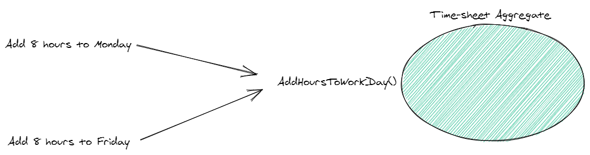

# DDD聚合：乐观并发

## 前言

使用乐观并发解决协作域的问题

## 回顾

我们研究了如何使用聚合根来对一致性边界建模。特别是，我们在时间跟踪应用程序中创建了对时间表应用更改的边界。



这种方法帮助我们更好地推理和管理与时间表业务概念相关的重要业务规则。我们系统的所有其他部分必须通过时间表集合——就像一个网关。

但是，这仍然不能解决聚合上的两个并发操作（逻辑上应该同时失败或成功的问题）。

## 协作域

协作域\(即资源可以由多个用户/客户同时更改的域\)要求对我们的业务逻辑进行更智能的处理。

在我们的例子中，有两个操作试图在时间表里增加8个小时。时间表目前是32个工作小时，不应该超过40个小时\(这是一个严格的商业规则\)。

因此，这两种操作中只有一种能够成功。但是，考虑到标准的实施，他们都将获得成功。


我们如何解决这个问题，使我们的“时间表不能超过40小时工作”的不变量永远不会被打破?

## 并发控制

解决这个问题最流行的方法之一是使用并发控制。换句话说，当数据不同步时，某种阻止对数据库并发写操作的方法。

### 悲观并发

一种方法是使用悲观并发。这是当我们锁定整个资源并且在任何时候只允许一个操作访问。

有点像当你打开excel,现在没有人在网络驱动器允许😂修改它。

但是，这种方法的性能很差，而且在某种程度上，我们只是用“蛮力”锁住了所有东西，这很幼稚。


### 乐观并发

乐观并发在某种程度上更加智能和灵活。它也允许一些有趣的失败模式。

它允许每个操作获得数据存储的当前版本。它可以是关系数据库、文档或事件源。没关系。

然后，每当回写聚合时，就根据数据存储对版本进行测试。如果版本不同步\(例如，在处理这个操作时，已经有其他人写入了存储\)，那么我们的操作就会失败。


这允许一种有趣的失败模式，其中失败的操作可以重新尝试。只要它的操作在数据存储中的更新仍然有意义。


### 如何实现它?

例如，事件存储就有这个内置功能。

例如，.NET 客户端的一个写方法是这样的:

```aspnet
Task<WriteResult> AppendToStreamAsync(string stream, long expectedVersion, params EventData[] events)
```

第二个参数是告诉事件存储您期望的版本的位置。如果不是那个版本，就像上面的例子一样，那么事件存储会告诉您。

在关系数据库中，你可能会这样做:

```sql
UPDATE sometable T
SET something = @someDataParam
WHERE T.RowVersion = @expectedRowVersionParam
```

这将返回受影响的行数，具体取决于数据库引擎。如果没有受到影响，那么您就知道事务“失败”，因为另一个操作在此操作之前写入了数据存储。

## 咨询

您是否希望在将这些概念应用到您自己的团队和项目时得到更多帮助?我可以帮助!

## 小结

整片文章非常简洁，使用的都是常规武器，让我们用乐观锁的思想去对协作域进行操作，保障一致性。

